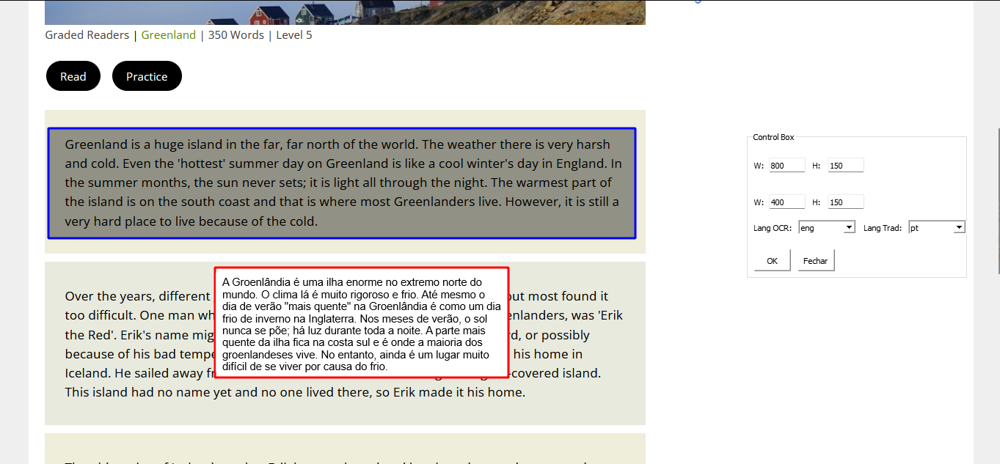

# Screen Reader Translator

Este projeto é uma ferramenta de sobreposição de tela que captura texto em uma área definida da tela, realiza OCR (Reconhecimento Óptico de Caracteres) para extrair o texto e traduz o texto extraído para um idioma selecionado.

## Requisitos

- Python 3.x
- PyQt5
- PyAutoGUI
- Pytesseract
- Translate

## Instalação

1. Clone o repositório:

    ```bash
    git clone https://github.com/seu_usuario/screen-reader-translator.git
    cd screen-reader-translator
    ```

2. Crie um ambiente virtual:

    ```bash
    python -m venv venv
    ```

3. Ative o ambiente virtual:

    - No Windows:
      ```bash
      .\venv\Scripts\activate
      ```
    - No macOS/Linux:
      ```bash
      source venv/bin/activate
      ```

4. Instale as dependências:

    ```bash
    pip install -r requirements.txt
    ```

## Uso

1. Execute o script principal:

    ```bash
    python tradutor_de_tela.py
    ```

2. Uma janela de sobreposição aparecerá na tela com duas caixas de seleção de área. A caixa azul é para capturar o texto, e a caixa vermelha é para exibir a tradução.

3. Ajuste as dimensões das caixas de captura e exibição usando as entradas de texto na caixa de controle.

4. Selecione o idioma de entrada para OCR e o idioma de saída para tradução usando as caixas de combinação na caixa de controle.

5. Clique no botão "OK" para capturar e traduzir o texto.

6. Para fechar a aplicação, clique no botão "Fechar".

## Exemplo

Aqui está um exemplo de como a interface do usuário se parece:



## Contribuição

Contribuições são bem-vindas! Sinta-se à vontade para abrir um problema ou enviar um pull request.
